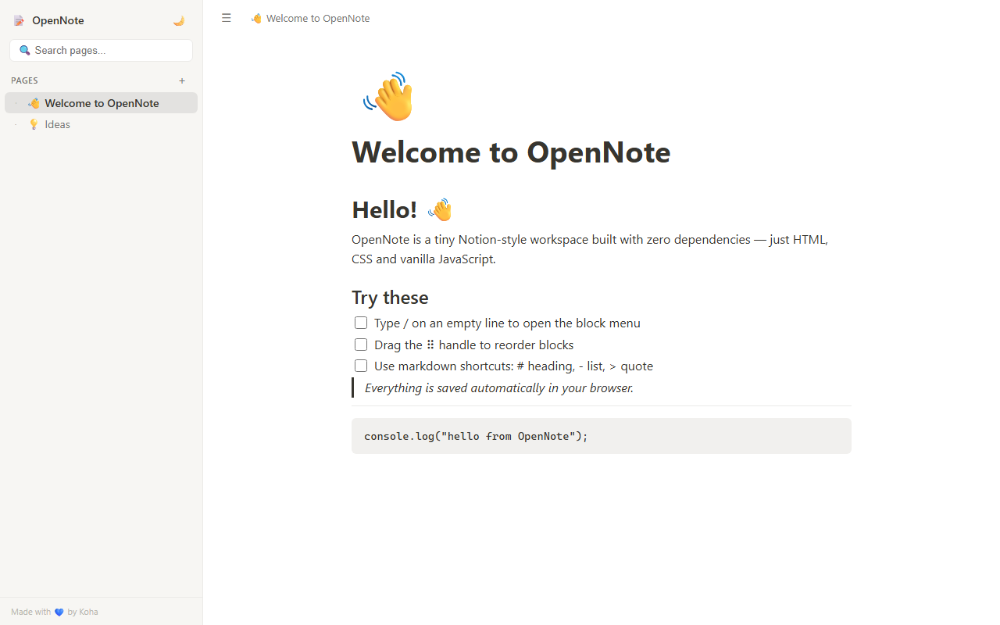

# 📝 OpenNote

A Notion-style workspace that runs entirely in your browser — **zero dependencies, no build step, no server**. Just open `index.html`.



## ✨ Features

- **Block-based editor** — text, headings (H1–H3), bulleted & numbered lists, to-dos, quotes, code blocks, dividers
- **Slash menu** — type `/` on a line to insert any block type, with fuzzy filtering and keyboard navigation
- **Markdown shortcuts** — `# `, `## `, `- `, `1. `, `[] `, `> `, ` ``` `, `--- ` transform blocks as you type
- **Nested pages** — unlimited sub-pages with a collapsible tree, search, and breadcrumbs
- **Drag & drop** — grab the `⠿` handle to reorder blocks
- **Smart editing** — Enter splits blocks, Backspace merges them, empty list items demote back to text (just like Notion)
- **Dark mode** 🌙 and per-page emoji icons
- **Auto-save** — everything persists to `localStorage`, no account needed

## 🚀 Run it

```bash
# any static server works, e.g.:
python -m http.server 8090
# then open http://localhost:8090
```

Or just double-click `index.html`.

## 🛠️ How it's built

| File | Role |
|---|---|
| `index.html` | App shell — sidebar, editor, slash menu |
| `styles.css` | Theming via CSS variables (light/dark) |
| `app.js` | All logic: state, rendering, editing, drag & drop |

The key design choice: **each block is its own `contenteditable` element** instead of one big editable region. That keeps Enter/Backspace/drag logic simple and predictable — the same architecture Notion uses.

## 📄 License

MIT — do whatever you want with it.

---

Made with 💙 by [Koha](https://github.com/Koha1312)
